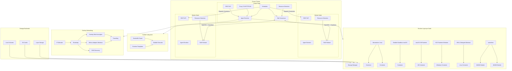

<p align="center">
  
</p>

<h1 align="center">ZLayer</h1>

<p align="center">
  A lightweight, Rust-based container orchestration platform with built-in networking, scaling, and observability.
</p>

<p align="center">
  <a href="https://zlayer.dev">Website</a> •
  <a href="https://zlayer.dev/docs">Documentation</a> •
  <a href="https://crates.io/crates/zlayer-spec">Crates.io</a>
</p>

## Overview

ZLayer provides declarative container orchestration without Kubernetes complexity. It runs first-class on Linux, macOS, and Windows:

- **Linux** — direct container management via [libcontainer](https://github.com/youki-dev/youki) (from the youki project), no daemon required.
- **macOS** — Seatbelt sandbox + APFS clonefile for native macOS containers, with an optional lightweight Linux VM runtime for full Linux compatibility.
- **Windows** — native Windows Server containers via the Host Compute Service (HCS), Linux workloads via a dedicated WSL2 distro, encrypted overlay networking via Wintun, and a Service Control Manager (SCM) service for the daemon.

Nodes form a Raft-based cluster with resource-aware scheduling, automatic failover, and distributed container placement.

### Key Features

- **Daemonless Runtime** - Uses libcontainer directly on Linux, HCS on Windows, and Seatbelt on macOS — no containerd/Docker daemon needed
- **Cross-Platform First-Class** - Linux, macOS, and Windows are all supported as both control-plane and worker nodes
- **WebAssembly Support** - First-class WASM runtime with WASIp1 & WASIp2 support via wasmtime
- **Multi-Language WASM SDKs** - Build WASM workloads from Rust, Go, Python, TypeScript, C, Zig, and more
- **Built-in Image Builder** - Dockerfile and ZImagefile parser with buildah integration on Linux/macOS and an HCS-backed Windows native builder (nanoserver / servercore base images) on Windows
- **Encrypted Overlay Networks** - Mesh networking via boringtun (userspace WireGuard) with IP allocation, DNS service discovery, health checking, and a Wintun adapter on Windows
- **Smart Scheduler** - Node placement with Shared/Dedicated/Exclusive allocation modes
- **Multi-Node Clustering** - Raft consensus, resource-aware node join with CPU/memory/disk/GPU detection, heartbeat-based health monitoring, automatic failover and rescheduling
- **Built-in Proxy** - L7 (HTTP/HTTPS/WebSocket) and L4 (TCP/UDP) with TLS termination, load balancing on every node
- **Adaptive Autoscaling** - Scale based on CPU, memory, or requests per second
- **Init Actions** - Pre-start lifecycle hooks (wait for TCP, HTTP, S3 pull/push, run commands)
- **Health Checks** - TCP, HTTP, and command-based health monitoring
- **OCI Compatible** - Pull images from any OCI-compliant registry
- **REST API** - Deploy, manage, and build images via HTTP API with streaming progress
- **S3 Layer Persistence** - Persist container state to S3 with crash-tolerant uploads
- **OpenTelemetry Tracing** - Distributed tracing with OTLP export and context propagation
- **Persistent SQLite Storage** - Tasks, workflows, audit log, sync state, and RBAC permissions are persisted to an embedded SQLite database
- **OpenID Connect SSO** - Federate authentication against any OIDC-compliant identity provider

## Architecture


```mermaid
graph TB
    subgraph Cluster[ZLayer Cluster]
        subgraph Leader[Leader Node]
            API1[REST API]
            Proxy1[Proxy TLS/HTTP2/LB]
            Agent1[Agent Runtime]
            Sched[Scheduler]
            Raft1[Raft Consensus]
            Res1[Resource Detection]

            API1 --> Agent1
            Proxy1 --> Agent1
            Sched --> Agent1
            Sched --> Raft1
            Res1 --> Raft1
        end

        subgraph Worker1[Worker Node]
            API2[REST API]
            Agent2[Agent Runtime]
            Raft2[Raft Follower]
            Res2[Resource Detection]
            Res2 --> Raft2
        end

        subgraph Worker2[Worker Node]
            API3[REST API]
            Agent3[Agent Runtime]
            Raft3[Raft Follower]
            Res3[Resource Detection]
            Res3 --> Raft3
        end

        Raft1 <-->|Raft RPC + Heartbeat| Raft2
        Raft1 <-->|Raft RPC + Heartbeat| Raft3
        Sched -->|Dispatch Containers| API2
        Sched -->|Dispatch Containers| API3
    end

    subgraph Runtime[Runtime Layer per Node]
        LC[libcontainer Linux]
        SB[Seatbelt Sandbox macOS]
        MV[macOS VM Runtime]
        HCS[HCS Runtime Windows]
        WSL[WSL2 Delegate Windows]
        WT[wasmtime]
        SM[Storage Manager]
        LC --> C1[Container]
        LC --> C2[Container]
        SB --> C3[Container]
        MV --> C4[VM Container]
        HCS --> C5[Windows Container]
        WSL --> C6[Linux Container]
        WT --> W1[WASM Module]
        WT --> W2[WASM Module]
    end

    subgraph Builder[Builder Subsystem]
        DF[Dockerfile Parser]
        BA[Buildah Executor]
        RT[Runtime Templates]
        DF --> BA
        RT --> BA
    end

    subgraph Overlay[Overlay Networking]
        IP[IP Allocator]
        Boot[Bootstrap]
        WG[Overlay Mesh boringtun]
        WIN[Wintun Adapter Windows]
        DNS[DNS Discovery]
        TUN[Tunneling]
        IP --> Boot --> WG
        Boot --> WIN
        Boot --> DNS
        WG --> TUN
        WIN --> TUN
    end

    subgraph Storage[Storage Backends]
        LV[Local Volumes]
        S3C[S3 Cache]
        LS[Layer Storage]
        LV --> SM
        S3C --> SM
        LS --> SM
    end

    Agent1 --> Runtime
    Agent1 --> Builder
    Agent1 --> Overlay
```

## Project Structure

```
crates/
├── zlayer-agent/          # Container runtime (libcontainer, Seatbelt, HCS, WSL2 delegate, storage manager)
├── zlayer-api/            # REST API server with build endpoints and streaming
├── zlayer-builder/        # Dockerfile/ZImagefile parser, buildah integration, HCS-backed Windows builder, runtime templates
├── zlayer-client/         # Internal HTTP client used by the CLI to talk to the daemon
├── zlayer-consensus/      # Raft consensus (openraft), snapshot management, cluster state machine
├── zlayer-core/           # Shared types and configuration
├── zlayer-docker/         # Docker Engine API compatibility shim (named-pipe transport on Windows, Unix socket elsewhere)
├── zlayer-git/            # Git operations: sync polling, webhook receiver, repo cloning
├── zlayer-hcs/            # Safe Rust wrapper for the Windows Host Compute Service (HCS v2)
├── zlayer-hns/            # Safe Rust wrapper for the Windows Host Compute Network Service (HCN v2)
├── zlayer-init-actions/   # Pre-start lifecycle actions (TCP, HTTP, S3, commands)
├── zlayer-manager/        # Web-based management UI (Leptos SSR + WASM)
├── zlayer-observability/  # Metrics, logging, OpenTelemetry tracing
├── zlayer-overlay/        # Encrypted overlay networking (boringtun + Wintun on Windows), IP allocation, DNS, health checks
├── zlayer-paths/          # Cross-platform path resolution (data dirs, sockets, run dirs)
├── zlayer-proxy/          # L4/L7 proxy with TLS
├── zlayer-py/             # Python bindings (pyo3, published to PyPI as `zlayer`)
├── zlayer-registry/       # OCI image pulling and caching (with optional S3 backend)
├── zlayer-scheduler/      # Raft-based distributed scheduler with placement logic
├── zlayer-secrets/        # Secrets management
├── zlayer-spec/           # Deployment specification types
├── zlayer-storage/        # S3-backed layer persistence with crash-tolerant uploads
├── zlayer-tui/            # Interactive terminal UI dashboard
├── zlayer-tunnel/         # Secure tunneling for node-to-node and on-demand service access
├── zlayer-web/            # Web frontend (Leptos SSR + hydration)
└── zlayer-wsl/            # WSL2 backend integration for Windows (distro management, vhd cap, exec)

bin/
└── zlayer/                # Single zlayer binary (CLI, TUI dashboard, runtime, builder)
```

## Requirements

ZLayer runs first-class on three platforms:

| Platform | Versions | Notes |
|----------|----------|-------|
| **Linux** | Kernel 5.4+ | Needs `libseccomp-dev`, `libssl-dev`, `pkg-config`, `cmake`, `protobuf-compiler` to build from source |
| **macOS** | 13+ Ventura | Built-in Seatbelt sandbox + APFS clonefile; no extra build deps |
| **Windows** | 10 21H2+, 11, Server 2019+ | HCS native runtime built in; WSL2 optional for Linux workloads |

Rust 1.91+ is required to build from source.

### Linux Dependencies

```bash
# Ubuntu/Debian
sudo apt-get install -y protobuf-compiler libseccomp-dev libssl-dev pkg-config cmake

# Fedora/RHEL
sudo dnf install -y protobuf-compiler libseccomp-devel openssl-devel pkgconfig cmake

# Arch
sudo pacman -S --needed protobuf libseccomp openssl pkgconf cmake
```

### macOS

No additional dependencies required. ZLayer uses the built-in Seatbelt sandbox and APFS clonefile for container isolation.

### Windows

For runtime use, no extra dependencies are required — the HCS runtime is built into the binary. WSL2 is only needed if you intend to run Linux workloads on a Windows host; the daemon will offer to install/configure it for you.

For building from source on Windows:

- `rustup default stable-msvc`
- `protoc` on PATH (e.g. `choco install protoc`)
- A working MSVC toolchain (Visual Studio Build Tools 2022 or newer)

## Installation

### Quick Install (Recommended)

```bash
# Linux / macOS
curl -fsSL https://zlayer.dev/install.sh | bash
```

```powershell
# Windows (PowerShell)
irm https://zlayer.dev/install.ps1 | iex
```

### From GitHub Releases

Download the latest release for your platform:

```bash
# Linux amd64
curl -fsSL https://github.com/BlackLeafDigital/ZLayer/releases/latest/download/zlayer-linux-amd64.tar.gz | tar xz
sudo mv zlayer /usr/local/bin/

# Linux arm64
curl -fsSL https://github.com/BlackLeafDigital/ZLayer/releases/latest/download/zlayer-linux-arm64.tar.gz | tar xz
sudo mv zlayer /usr/local/bin/

# macOS (Apple Silicon)
curl -fsSL https://github.com/BlackLeafDigital/ZLayer/releases/latest/download/zlayer-darwin-arm64.tar.gz | tar xz
sudo mv zlayer /usr/local/bin/

# macOS (Intel)
curl -fsSL https://github.com/BlackLeafDigital/ZLayer/releases/latest/download/zlayer-darwin-amd64.tar.gz | tar xz
sudo mv zlayer /usr/local/bin/
```

For Windows, download `zlayer-windows-amd64.zip` from the [latest release](https://github.com/BlackLeafDigital/ZLayer/releases/latest), extract it, and add the directory containing `zlayer.exe` to `PATH`.

Or pin to a specific version:

```bash
# Replace VERSION with desired version (e.g., v0.1.0)
curl -fsSL https://github.com/BlackLeafDigital/ZLayer/releases/download/VERSION/zlayer-linux-amd64.tar.gz | tar xz
```

### Interactive TUI

Running `zlayer` with no arguments launches a full operational dashboard with menu items for Dashboard, Deploy, Build Image, Validate, Runtimes, and Quit. All build and runtime functionality is built into the single binary.

See [bin/zlayer/README.md](./bin/zlayer/README.md) for details.

### From Source

```bash
# Clone the repo
git clone https://github.com/BlackLeafDigital/ZLayer.git
cd ZLayer

# Install dependencies (Ubuntu/Debian)
sudo apt-get install -y protobuf-compiler libseccomp-dev libssl-dev pkg-config cmake

# macOS: no extra dependencies needed (uses system Seatbelt + APFS)

# Build the single binary
cargo build --release -p zlayer

# Install
sudo cp target/release/zlayer /usr/local/bin/
```

On Windows, build from source like this (PowerShell):

```powershell
# Clone
git clone https://github.com/BlackLeafDigital/ZLayer.git
cd ZLayer

# Toolchain + protoc (one time)
rustup default stable-msvc
choco install protoc -y

# Build with Windows-native HCS runtime + WSL2 delegate enabled
cargo build --release -p zlayer --no-default-features --features hcs-runtime,wsl

# Install (any directory on PATH works)
Copy-Item target\release\zlayer.exe "$env:USERPROFILE\bin\zlayer.exe"
```

## Quick Start

### 1. Define a deployment

```yaml
# deployment.yaml
version: v1
deployment: my-app

services:
  web:
    rtype: service
    image:
      name: nginx:latest
    endpoints:
      - name: http
        protocol: http
        port: 80
        expose: public
    scale:
      mode: adaptive
      min: 1
      max: 5
    health:
      check:
        type: http
        url: /health
        expect_status: 200
```

### 2. Deploy a WASM workload

ZLayer auto-detects WASM artifacts from OCI registries:

```yaml
# wasm-deployment.yaml
version: v1
deployment: my-wasm-app

services:
  handler:
    rtype: service
    image:
      # ZLayer auto-detects WASM artifacts by media type
      name: ghcr.io/myorg/my-wasm-handler:v1
    env:
      - name: LOG_LEVEL
        value: info
```

### 3. Deploy

Deployment specs use the `<name>.zlayer.yml` naming convention (e.g. `nginx.zlayer.yml`, `myapp.zlayer.yml`). When a single `*.zlayer.yml` file is present in the current directory, `zlayer deploy` and `zlayer up` auto-discover it:

```bash
# Auto-discovers *.zlayer.yml in current directory
zlayer deploy

# Or specify explicitly
zlayer deploy nginx.zlayer.yml
```

### 4. Check status

```bash
zlayer status my-app
```

## Multi-Node Clustering

ZLayer nodes form a Raft-based cluster for distributed container scheduling, automatic failover, and resource pooling. A single-node deployment works out of the box; adding nodes scales capacity without configuration changes.

### How It Works

1. **Bootstrap** -- The first node initializes the cluster and becomes the Raft leader. It detects local CPU, memory, disk, and GPU resources and registers itself in the cluster state.
2. **Join** -- Additional nodes join via `zlayer node join`, providing a join token for authentication. Each joining node reports its hardware resources (CPU cores, memory, disk, GPUs) which are stored in the Raft-replicated cluster state. Nodes can join in two modes:
   - **`full`** (default) -- Eligible to become a voting member. The cluster dynamically promotes full nodes to voters to maintain an optimal odd-numbered voter set.
   - **`replicate`** -- Always a non-voting learner. Receives full data replication but never participates in leader elections or quorum.
3. **Dynamic Voter Management** -- The cluster automatically maintains an odd number of voters for optimal fault tolerance: 1 node = 1 voter, 2 nodes = 1 voter + 1 learner, 3 nodes = 3 voters, 5 nodes = 5 voters, 7+ nodes = 7 voters (cap) with the rest as learners. This means a 2-node cluster works safely -- the first node up wins leadership, and the cluster remains available if the learner goes down.
4. **Heartbeat** -- Worker nodes send resource usage heartbeats to the leader every 5 seconds. If a node misses heartbeats for 30 seconds, the leader marks it as "dead" and rebalances the voter set (promoting a learner if a voter died).
5. **Scheduling** -- When a deployment is created or scaled, the scheduler builds a placement plan across all live nodes using bin-packing, dedicated, or exclusive allocation modes (depending on the service spec). Containers are dispatched to remote nodes via internal API calls.
6. **Failover** -- When a node dies, the scheduler automatically reschedules its containers to remaining live nodes. If a dead node later resumes heartbeating, it is automatically recovered to "ready" status.
7. **Disaster Recovery** -- If the leader is permanently lost in a small cluster, a surviving node can take over via `zlayer node force-leader`. This preserves cluster state and re-bootstraps as a new single-node leader.

### Bootstrapping a Cluster

```bash
# Node 1: Initialize the cluster (becomes leader)
zlayer node init --advertise-addr 10.0.0.1

# Generate a join token for workers
zlayer node generate-join-token -d my-deploy -a http://10.0.0.1:3669
```

### Adding Worker Nodes

```bash
# Node 2: Join the cluster
zlayer node join 10.0.0.1:3669 --token <TOKEN> --advertise-addr 10.0.0.2

# Node 3: Join the cluster
zlayer node join 10.0.0.1:3669 --token <TOKEN> --advertise-addr 10.0.0.3
```

Each joining node automatically detects its hardware resources (CPU, memory, disk, GPUs) and reports them to the leader. The scheduler uses these resources for placement decisions.

### Resource Detection

ZLayer detects the following resources on each node at init and join time:

| Resource | Linux | macOS | Windows |
|----------|-------|-------|---------|
| CPU cores | `/proc/cpuinfo` | `sysctl hw.ncpu` | `GetLogicalProcessorInformationEx` |
| Memory | `/proc/meminfo` | `sysctl hw.memsize` | `GlobalMemoryStatusEx` |
| Disk | `statvfs` | `statvfs` | `GetDiskFreeSpaceEx` |
| GPUs | sysfs PCI scan + `nvidia-smi` | `system_profiler` | DXGI (`IDXGIFactory1::EnumAdapters1`) |

GPU detection identifies vendor (NVIDIA, AMD, Intel), VRAM, model name, and device paths. GPU-aware placement is available through node labels and the scheduler's resource accounting.

### Node Status

Nodes transition between three states:

| Status | Meaning |
|--------|---------|
| `ready` | Node is healthy, accepting new containers |
| `draining` | Node is being evacuated, no new containers scheduled |
| `dead` | Node missed heartbeats for 30s, containers rescheduled |

```bash
# View cluster nodes and their status
zlayer node list

# Check individual node status
zlayer node status
```

### Test coverage

The behaviors described above (cluster bootstrap, two-mode join, dynamic voter management, heartbeat health monitoring, automatic failover, and allocation modes) are backed by automated tests:

- **In-process integration tests** under `crates/zlayer-scheduler/tests/`: `single_node_bootstrap`, `two_node_cluster`, `three_node_replication`, `leader_failover`, `allocation_modes`. Each test brings up N `RaftService` instances on loopback ports and drives them through the real HTTP/2 transport.
- **Process-level e2e** via `crates/zlayer-manager/tests/e2e/scripts/run-suite.py` suites `cluster_3node` (boot a 3-node cluster from `zlayer node init` + `zlayer node join`, assert all nodes reach `status: ready` with the correct roles) and `cluster_failover` (kill a worker, assert the leader marks it `dead` within 30s, restart it, assert recovery to `ready`).

Run them with `cargo test --workspace` and `uv run python crates/zlayer-manager/tests/e2e/scripts/run-suite.py cluster_3node` respectively.

## Deployment Spec

The deployment spec is documented inline below and in the per-type schemas exposed by `zlayer spec dump`. The canonical Rust types live in the [`zlayer-spec`](./crates/zlayer-spec) crate.

### Resource Types

| Type | Description |
|------|-------------|
| `service` | Long-running, load-balanced container |
| `job` | Run-to-completion, triggered by endpoint/CLI |
| `cron` | Scheduled run-to-completion |

### Scaling Modes

| Mode | Description |
|------|-------------|
| `adaptive` | Auto-scale based on CPU/memory/RPS targets |
| `fixed` | Fixed number of replicas |
| `manual` | No automatic scaling |

### Node Allocation Modes

| Mode | Description |
|------|-------------|
| `shared` | Containers bin-packed onto nodes with available capacity |
| `dedicated` | Each replica gets its own node (1:1 mapping) |
| `exclusive` | Service has nodes exclusively to itself (no other services) |

### Protocol Support

ZLayer's built-in proxy supports both L7 and L4 protocols:

| Protocol | Type | Use Case |
|----------|------|----------|
| `http` | L7 | Web applications, REST APIs |
| `https` | L7 | Secure web with auto-TLS |
| `websocket` | L7 | Real-time bidirectional communication |
| `tcp` | L4 | Databases, game servers, custom protocols |
| `udp` | L4 | Game servers, DNS, VOIP |

#### L4 TCP/UDP Proxying

TCP and UDP endpoints are automatically proxied with load balancing:

```yaml
services:
  postgres:
    image: { name: postgres:16 }
    endpoints:
      - name: db
        protocol: tcp
        port: 5432
        expose: public
        stream:                    # Optional L4 configuration
          tls: true                # TLS termination
          health_check:
            type: tcp_connect

  game-server:
    image: { name: my-game:latest }
    endpoints:
      - name: game
        protocol: udp
        port: 27015
        expose: public
        stream:
          session_timeout: "120s"  # UDP session timeout
          health_check:
            type: udp_probe
            request: "\\xFF\\xFF\\xFF\\xFFTSource Engine Query"
```

**Stream Configuration Options:**

| Option | Type | Description |
|--------|------|-------------|
| `tls` | bool | Enable TLS termination (TCP only) |
| `proxy_protocol` | bool | Pass client IP via PROXY protocol |
| `session_timeout` | string | UDP session timeout (default: 60s) |
| `health_check` | object | L4 health check (tcp_connect or udp_probe) |

### Tunneling

ZLayer provides secure tunneling for accessing internal services, similar to Cloudflare Tunnel or Rathole.

#### Use Cases
- **SSH to containers** - Access containers without exposing overlay network
- **Database access** - Securely expose PostgreSQL/MySQL through authenticated tunnels
- **Home server exposure** - Expose services from NAT'd home server through cloud node
- **On-demand access** - Temporary local access to internal services via CLI

#### Node-to-Node Tunnels

Expose services from one node through another:

```bash
# Expose Jellyfin from home server (nas) through cloud server (hetzner)
zlayer tunnel add jellyfin \
  --from nas \
  --to hetzner \
  --local-port 8096 \
  --remote-port 8096 \
  --expose public

# List tunnels
zlayer tunnel list

# Check status
zlayer tunnel status

# Remove tunnel
zlayer tunnel remove jellyfin
```

#### On-Demand Access

Request temporary local access to internal services:

```bash
# Access internal postgres - creates local proxy
zlayer tunnel access postgres:db --local-port 5432
# Tunnel open at localhost:5432

# Access with time limit
zlayer tunnel access postgres:db --ttl 1h

# List active sessions
zlayer tunnel access list
```

#### Tunnel in Deployment Spec

```yaml
services:
  postgres:
    image: { name: postgres:16 }
    endpoints:
      - name: db
        protocol: tcp
        port: 5432
        expose: internal
        tunnel:
          enabled: true
          to: hetzner
          remote_port: 15432
          access:
            enabled: true
            max_ttl: "4h"
            audit: true

# Top-level tunnels (node-to-node)
tunnels:
  jellyfin:
    from: nas
    to: hetzner
    local_port: 8096
    remote_port: 8096
    protocol: tcp
    expose: public
```

### Storage & Persistence

ZLayer provides comprehensive storage options for containers.

#### Volume Mounts

Mount external storage into containers:

| Type | Description | Lifecycle |
|------|-------------|-----------|
| `bind` | Host path mounted into container | Host-managed |
| `named` | Persistent named volume | Survives container restarts |
| `anonymous` | Auto-named volume | Cleaned on container removal |
| `tmpfs` | Memory-backed filesystem | Lost on container stop |
| `s3` | S3-backed FUSE mount (requires s3fs) | Remote-managed |

#### Storage Tiers

Named and anonymous volumes support configurable performance tiers:

| Tier | Description | SQLite Safe |
|------|-------------|-------------|
| `local` | Direct local filesystem (SSD/NVMe) | Yes |
| `cached` | bcache-backed tiered storage | Yes |
| `network` | NFS/network storage | No |

#### Layer Persistence

Persist container filesystem changes (OverlayFS upper layer) to S3:

- **Automatic snapshots** - Tar + zstd compress the upper layer on container stop
- **Crash-tolerant uploads** - Multipart S3 uploads with resume capability
- **Content-addressable** - Layers keyed by SHA256 digest (automatic deduplication)
- **Cross-node restore** - Containers can resume state on different nodes

#### S3 Init Actions

Transfer files to/from S3 as part of container lifecycle:

| Action | Description |
|--------|-------------|
| `init.s3_pull` | Download files from S3 before container starts |
| `init.s3_push` | Upload files to S3 after container stops |

#### Example Storage Configuration

```yaml
services:
  api:
    image:
      name: myapi:latest
    storage:
      # Bind mount (read-only config)
      - type: bind
        source: /etc/myapp/config
        target: /app/config
        readonly: true

      # Named persistent volume
      - type: named
        name: api-data
        target: /app/data
        tier: local  # SQLite-safe

      # Anonymous cache (auto-cleaned)
      - type: anonymous
        target: /app/cache

      # Memory-backed temp
      - type: tmpfs
        target: /app/tmp
        size: 256Mi
        mode: 1777

      # S3 model storage (requires s3fs)
      - type: s3
        bucket: my-models
        prefix: v1/
        target: /app/models
        readonly: true
        endpoint: https://s3.us-west-2.amazonaws.com

    # S3 init actions for artifact transfer
    init:
      - action: init.s3_pull
        bucket: my-artifacts
        key: models/latest.bin
        destination: /app/models/model.bin
```

## Image Building

ZLayer includes a built-in image builder that supports Dockerfiles and runtime templates.

### Runtime Templates

Build images without writing a Dockerfile using pre-configured templates:

| Runtime | Description |
|---------|-------------|
| `node20`, `node22` | Node.js apps on Alpine |
| `python312`, `python313` | Python apps on Debian slim |
| `rust` | Static musl binaries |
| `go` | Static Go binaries |
| `deno` | Deno JavaScript/TypeScript runtime |
| `bun` | Bun JavaScript runtime |

### Building via API

```bash
# Build from a Dockerfile
curl -X POST http://localhost:3000/api/v1/build/json \
  -H "Content-Type: application/json" \
  -d '{
    "context_path": "/path/to/app",
    "tags": ["myapp:latest"]
  }'

# Build using a runtime template
curl -X POST http://localhost:3000/api/v1/build/json \
  -H "Content-Type: application/json" \
  -d '{
    "context_path": "/path/to/node/app",
    "runtime": "node22",
    "tags": ["myapp:latest"]
  }'

# Stream build progress via SSE
curl http://localhost:3000/api/v1/build/{id}/stream
```

### Building via CLI

```bash
# Build from Dockerfile
zlayer build /path/to/app -t myapp:latest

# Build with runtime template (auto-detected)
zlayer build /path/to/app -t myapp:latest --runtime node22

# List available templates
zlayer runtimes
```

## ZImagefile

ZImagefile is ZLayer's YAML-based alternative to Dockerfiles. It provides a cleaner syntax for defining image builds, with first-class support for cache mounts, multi-stage builds, and WASM targets -- all in familiar YAML instead of Dockerfile DSL.

### Why ZImagefile?

- **YAML syntax** -- No new DSL to learn, works with existing YAML tooling and linting
- **Declarative cache mounts** -- Cache directories are a simple `cache:` list instead of `--mount=type=cache,...` strings
- **Cleaner multi-stage** -- Named stages as a YAML map with `from:` references instead of `COPY --from=`
- **Four build modes** -- Runtime templates, single-stage, multi-stage, and WASM in one format

### Mode 1: Runtime Template Shorthand

The simplest form -- just specify a runtime template name:

```yaml
# ZImagefile
runtime: node22
cmd: "node server.js"
```

This expands to the full `node22` runtime template (Alpine-based Node.js image with dependency caching).

### Mode 2: Single-Stage Build

A single base image with ordered build steps:

```yaml
# ZImagefile
base: "node:22-alpine"
workdir: /app
steps:
  - copy: ["package.json", "package-lock.json"]
    to: "./"
  - run: "npm ci"
  - copy: "."
    to: "."
  - run: "npm run build"
env:
  NODE_ENV: production
expose: 3000
cmd: ["node", "dist/index.js"]
```

### Mode 3: Multi-Stage Build

Named stages as a YAML map. The last stage is the output image:

```yaml
# ZImagefile
stages:
  builder:
    base: "rust:1.83-slim"
    workdir: /src
    steps:
      - copy: ["Cargo.toml", "Cargo.lock"]
        to: "./"
      - run: "cargo fetch"
        cache:
          - target: /usr/local/cargo/registry
            id: cargo-registry
            sharing: shared
          - target: /src/target
            id: cargo-target
            sharing: shared
      - copy: "src"
        to: "./src"
      - run: "cargo build --release"
        cache:
          - target: /src/target
            id: cargo-target
            sharing: shared

  runtime:
    base: "debian:bookworm-slim"
    steps:
      - run: "apt-get update && apt-get install -y --no-install-recommends ca-certificates && rm -rf /var/lib/apt/lists/*"
      - copy: "target/release/myapp"
        from: builder
        to: "/usr/local/bin/myapp"
        chmod: "755"
    cmd: ["/usr/local/bin/myapp"]

expose: 8080
user: "nobody"
```

### Mode 4: WASM Build

Build WebAssembly components directly:

```yaml
# ZImagefile
wasm:
  target: preview2
  optimize: true
  language: rust
  wit: "./wit"
  output: "./output.wasm"
```

WASM ZImagefiles are built with `zlayer wasm build`, not `zlayer build`.

### Key Differences from Dockerfile

- **`steps:` list** replaces inline instructions -- each step has exactly one action (`run`, `copy`, `add`, `env`, `workdir`, `user`)
- **`copy:` / `to:`** replaces `COPY src dest` -- source and destination are separate fields
- **`from:`** replaces `COPY --from=stage` -- a field on copy/add steps
- **`owner:` / `chmod:`** replace `--chown` and `--chmod` flags
- **`cache:` list** on `run` steps replaces `--mount=type=cache,target=...` syntax
- **`stages:` map** replaces multiple `FROM` blocks -- named stages in insertion order
- **Top-level metadata** (`env`, `expose`, `cmd`, `entrypoint`, `user`, etc.) is applied to the final output image

### Building with ZImagefile

```bash
# Auto-detects ZImagefile in context directory
zlayer build .

# Specify a ZImagefile path explicitly
zlayer build -z path/to/ZImagefile .

# Combine with tags
zlayer build -z ZImagefile -t myapp:latest .
```

Detection order: runtime template > explicit `-z` path > `ZImagefile` in context > `Dockerfile` in context.

## CLI Reference

The `zlayer` binary provides comprehensive command-line management. Every subcommand below is defined in [`bin/zlayer/src/cli.rs`](./bin/zlayer/src/cli.rs).

### Lifecycle

```bash
# Deploy + run in the foreground (auto-discovers *.zlayer.yml). Ctrl+C to stop.
zlayer up
zlayer up myapp.zlayer.yml
zlayer up -b                                    # detach after deploying

# Stop everything in a deployment (auto-discovers from *.zlayer.yml)
zlayer down
zlayer down my-app

# Deploy without running in the foreground
zlayer deploy                                   # auto-discovers
zlayer deploy deployment.yaml
zlayer deploy deployment.yaml --dry-run

# Join an existing deployment using a token
zlayer join <TOKEN>
zlayer join <TOKEN> --service web --replicas 2

# List running deployments / services / containers
zlayer ps
zlayer ps --deployment my-app --containers --format json

# Cluster-wide health snapshot
zlayer status

# Exec into a running service container
zlayer exec web -- /bin/sh
zlayer exec --deployment my-app --replica 2 api -- cat /etc/hosts

# Stream service logs (auto-resolves deployment when unambiguous)
zlayer logs -s web --follow
zlayer logs -d my-app -s api -n 500

# Stop a deployment or one of its services
zlayer stop my-app
zlayer stop my-app --service web --force
zlayer stop --timeout 60 my-app

# Run a local command with secrets injected as env vars
zlayer run --env dev -- pnpm run dev
zlayer run --env prod --merge global --merge baseline -- ./bin/server
zlayer run --env dev --dry-run --unmask         # admin-only plaintext preview

# Validate a spec without deploying
zlayer validate deployment.yaml
```

### Build & Image

```bash
# Build from Dockerfile or ZImagefile (auto-detected)
zlayer build . -t myapp:latest
zlayer build -z ZImagefile -t myapp:latest .
zlayer build . --runtime node22 -t myapp:latest
zlayer build . --runtime-auto -t myapp:latest
zlayer build . --build-arg VERSION=1.0 -t myapp:1.0.0
zlayer build . --target production -t myapp:prod
zlayer build . --push -t ghcr.io/me/myapp:1.0
zlayer build . --platform windows/amd64 -t myapp:win    # HCS-backed Windows build
zlayer build . --platform linux/amd64  -t myapp:linux

# Multi-image pipeline (auto-discovers ZPipeline.yaml / zlayer-pipeline.yaml)
zlayer pipeline
zlayer pipeline -f my-pipeline.yaml --set VERSION=1.0 --push
zlayer pipeline --only web,api --platform linux/amd64,linux/arm64

# Runtime template list
zlayer runtimes

# Pull an image into the local cache
zlayer pull ghcr.io/blackleafdigital/zlayer-manager:latest

# Export / import OCI image tarballs (URL imports support HTTP Basic auth)
zlayer export myapp:v1 -o myapp.tar
zlayer export myapp:v1 -o myapp.tar.gz --gzip
zlayer import myapp.tar
zlayer import myapp.tar.gz --tag myapp:imported
zlayer import https://forge.example.com/myapp-oci.tar -u user -p token

# Image cache management
zlayer image ls
zlayer image inspect ubuntu:22.04
zlayer image push myregistry/myimage:tag --username u --password p
zlayer image rm myimage:tag --force
zlayer system prune --yes                       # remove dangling cached images

# WASM artifacts
zlayer wasm build .                             # auto-detect language
zlayer wasm build --language rust --target wasip2 --optimize ./my-rust-app
zlayer wasm export ./app.wasm --name myapp:v1
zlayer wasm push  ./app.wasm ghcr.io/myorg/myapp:v1
zlayer wasm validate ./handler.wasm
zlayer wasm info     ./handler.wasm
```

### Cluster & Node

```bash
# Bootstrap as the cluster leader
zlayer node init --advertise-addr 10.0.0.1

# Join an existing cluster
zlayer node join 10.0.0.1:3669 --token <TOKEN> --advertise-addr 10.0.0.2

# Inspect / manage cluster nodes
zlayer node list
zlayer node status [<node-id>]
zlayer node remove <node-id> [--force]
zlayer node set-mode <node-id> --mode dedicated --services api,web
zlayer node label <node-id> gpu=true
zlayer node generate-join-token -d my-deploy -a http://10.0.0.1:3669
zlayer node force-leader                        # disaster recovery

# Networks (overlay + per-deployment networks)
zlayer network ls
zlayer network inspect <name>
zlayer network create <name>
zlayer network rm <name>
zlayer network status
zlayer network peers
zlayer network dns

# Volumes
zlayer volume ls
zlayer volume rm my-volume --force
```

### Server & Daemon

```bash
# Start the API server in the foreground
zlayer serve --bind 0.0.0.0:3669

# Background daemon mode
zlayer serve --bind 0.0.0.0:3669 --daemon

# Run as a Windows Service under SCM (set automatically by the SCM)
zlayer serve --service

# Override the WSL2 vhd cap (Windows + `wsl` feature only)
zlayer serve --vhd-gb 120

# Expose the Docker Engine API socket (requires `docker-compat` feature)
zlayer serve --docker-socket --docker-socket-path /var/run/docker.sock

# Manage the system service (systemd on Linux, launchd on macOS, SCM on Windows)
zlayer daemon install [--no-start] [--bind 0.0.0.0:3669]
zlayer daemon uninstall
zlayer daemon start | stop | restart | status
zlayer daemon reset --force                     # wipes Raft storage

# Windows-only maintenance (compact the WSL2 distro VHDX)
zlayer windows compact [--force]
```

### Resources

```bash
# Containers
zlayer container ls [--output json]
zlayer container inspect <id>
zlayer container logs <id> [--tail 200]
zlayer container stats <id>
zlayer container rm <id> [--force]

# Secrets (encrypted at rest, scoped to environments)
zlayer secret ls --env dev
zlayer secret create API_KEY --random --env dev
zlayer secret get API_KEY --env dev --reveal
zlayer secret set API_KEY --from-file ./key.txt --env prod
zlayer secret rotate API_KEY --random --env prod
zlayer secret rm API_KEY --env dev
zlayer secret unset API_KEY --env dev
zlayer secret import --file .env --env dev
zlayer secret export --env prod --format env
zlayer secret grant alice@example.com dev write
zlayer secret revoke alice@example.com dev
zlayer secret permissions dev

# Environments (namespaces for secrets, deployments)
zlayer env ls
zlayer env create dev --description "Developer env"
zlayer env show <id>
zlayer env update <id> --name staging
zlayer env delete <id> --yes

# Plaintext variables (NOT secrets — used for template substitution)
zlayer variable ls
zlayer variable set APP_VERSION 1.2.3
zlayer variable get APP_VERSION
zlayer variable unset APP_VERSION

# Tasks (runnable scripts)
zlayer task ls
zlayer task create --name backup --kind bash --body "tar czf /tmp/x.tar.gz /data"
zlayer task run <id>
zlayer task logs <id>

# Workflows (DAGs of task / build / deploy / sync steps)
zlayer workflow ls
zlayer workflow create --name release --steps '[...]'
zlayer workflow run <id>
zlayer workflow logs <id>

# Notifiers (Slack, Discord, webhook, SMTP)
zlayer notifier ls
zlayer notifier create --name oncall --kind slack --webhook-url https://...
zlayer notifier test <id>

# Jobs and cron jobs
zlayer job ls
zlayer job trigger backup --deployment my-app
zlayer job status backup --deployment my-app
zlayer job cron ls
zlayer job cron status nightly --deployment my-app
```

### Auth & RBAC

```bash
# First-run admin bootstrap
zlayer auth bootstrap --email admin@local --password hunter2

# Sessions
zlayer auth login --email admin@local
zlayer auth whoami
zlayer auth logout

# JWT tokens
zlayer token create --subject ci --hours 168 --roles admin
zlayer token decode <token>
zlayer token info
zlayer token show

# Users (admin)
zlayer user ls
zlayer user create --email dev@example.com --role user
zlayer user set-role <id> --role admin
zlayer user set-password --email dev@example.com --random
zlayer user delete <id> --yes

# Groups (admin)
zlayer group list
zlayer group create --name developers
zlayer group member add --group <id> --user <id>
zlayer group member remove --group <id> --user <id>
zlayer group delete <id> --yes

# Permissions
zlayer permission list --user <id>
zlayer permission grant --subject-kind user --subject <id> \
    --resource-kind deployment --resource <name> --level write
zlayer permission revoke <permission-id>

# Audit log
zlayer audit tail --limit 100 --user <id>
```

### Projects & GitOps

```bash
# Projects group deployments, credentials, environments, and build configuration
zlayer project ls
zlayer project create my-app --git-url https://forge.example.com/me/app \
    --git-branch main --build-kind dockerfile --build-path ./
zlayer project show <id>
zlayer project update <id> --description "Frontend"
zlayer project delete <id> --yes
zlayer project link-deployment <id> my-app
zlayer project unlink-deployment <id> my-app
zlayer project list-deployments <id>
zlayer project pull <id>                        # clone or fast-forward on the daemon
zlayer project auto-deploy <id> --enabled true
zlayer project poll-interval <id> --seconds 60
zlayer project webhook show   <id>
zlayer project webhook rotate <id>

# Credentials (encrypted at rest)
zlayer credential registry ls
zlayer credential registry add --registry ghcr.io --username u --auth-type basic
zlayer credential registry delete <id> --yes
zlayer credential git ls
zlayer credential git add --name forgejo --kind pat --value <pat>
zlayer credential git delete <id> --yes

# GitOps syncs (a sync points at a directory of resource YAMLs in a project)
zlayer sync ls
zlayer sync create --name infra --project <project-id> --path ./gitops --auto-apply
zlayer sync diff  <id>
zlayer sync apply <id>
zlayer sync delete <id> --yes
```

### Tunneling

```bash
zlayer tunnel create --name db-access --services postgres,redis --ttl-hours 24
zlayer tunnel list
zlayer tunnel revoke <id>
zlayer tunnel connect --server wss://tunnel.example.com/tunnel/v1 \
    --token tun_xxx --service ssh:22:2222
zlayer tunnel add jellyfin --from nas --to hetzner \
    --local-port 8096 --remote-port 8096 --expose public
zlayer tunnel remove jellyfin
zlayer tunnel status
zlayer tunnel access postgres.service.zlayer --local-port 15432 --ttl 1h
```

### Manager UI

ZLayer includes a web-based management dashboard (similar to [Komodo](https://komo.do)):

```bash
# Generate a zlayer-manager deployment spec and optionally bootstrap an admin
zlayer manager init                              # interactive
zlayer manager init --port 8080 --deploy
zlayer manager init --email admin@example.com --random
zlayer manager init --env-file /run/secrets/manager.env --no-bootstrap

# Status / stop
zlayer manager status
zlayer manager stop --force
```

Features include:
- **Dashboard** - System overview, node counts, uptime
- **Deployments** - Manage deployments and services
- **Builds** - View build history and logs
- **Nodes** - Monitor cluster nodes
- **Overlay** - Overlay mesh status, peer health, DNS discovery
- **Settings** - Secrets management, cluster configuration

See [crates/zlayer-manager/README.md](./crates/zlayer-manager/README.md) for development details.

### Spec Inspection

```bash
# Dump parsed spec as YAML (default) or JSON
zlayer spec dump deployment.yaml
zlayer spec dump deployment.yaml --format json
```

### Docker Compatibility (`--features docker-compat`)

The Docker compatibility shim is the easiest path off Docker — point existing Docker tooling (Docker CLI, `docker-compose`, IDE integrations, CI runners) at the ZLayer daemon and they keep working. The `zlayer docker install` command configures the daemon to expose the Docker Engine API socket (named pipe on Windows, Unix socket elsewhere), drops `docker` and `docker-compose` shim binaries on `PATH`, writes `DOCKER_HOST` and `DOCKER_BUILDKIT=0` into the user's shell profile, and optionally symlinks `/var/run/docker.sock`.

```bash
# Install / uninstall the compatibility shim
zlayer docker install
zlayer docker uninstall

# Container ops (1:1 Docker CLI parity)
zlayer docker run --rm -it alpine sh
zlayer docker ps
zlayer docker stop <id>
zlayer docker kill <id>
zlayer docker rm <id>
zlayer docker start <id>
zlayer docker restart <id>
zlayer docker exec -it <id> bash
zlayer docker logs <id> --tail 100

# Image ops
zlayer docker build -t myapp:latest .
zlayer docker pull alpine:3.19
zlayer docker push ghcr.io/me/app:v1
zlayer docker images
zlayer docker rmi <image>
zlayer docker tag src:latest dst:latest

# Inspection / files / auth / stats
zlayer docker inspect <id>
zlayer docker cp <id>:/etc/hosts ./hosts
zlayer docker login ghcr.io
zlayer docker logout ghcr.io
zlayer docker stats <id>

# Volumes / networks / compose / system
zlayer docker volume ls
zlayer docker network ls
zlayer docker compose up -f docker-compose.yaml
zlayer docker system prune
```

### Tools

```bash
# Launch the interactive TUI dashboard (no args = TUI by default)
zlayer tui
zlayer tui -c ./my-build-context

# Generate shell completions
zlayer completions bash       > /etc/bash_completion.d/zlayer
zlayer completions zsh        > "${fpath[1]}/_zlayer"
zlayer completions fish       > ~/.config/fish/completions/zlayer.fish
zlayer completions powershell > $PROFILE.zlayer-completions.ps1
zlayer completions elvish     > ~/.config/elvish/lib/zlayer.elv
```

## WebAssembly Support

ZLayer supports WebAssembly (WASM) as a first-class runtime alongside traditional OCI containers. WASM workloads benefit from near-instant cold starts, smaller image sizes, and universal portability.

### Supported Languages

| Tier | Languages | Notes |
|------|-----------|-------|
| **Tier 1** | Rust, Go, C/C++, Zig, AssemblyScript | Direct compilation to WASM |
| **Tier 2** | C#/.NET, Kotlin, Swift | Experimental/growing support |
| **Tier 3** | Python, JavaScript, Ruby, PHP, Lua | Interpreter-based (via WASM-compiled runtimes) |

### WASM vs Container Comparison

| Aspect | Container | WASM |
|--------|-----------|------|
| **Cold Start** | ~300ms | ~1-5ms |
| **Image Size** | 10MB - 1GB+ | 100KB - 10MB |
| **Isolation** | Linux namespaces/cgroups | WASM sandbox |
| **Portability** | Arch-specific (x86/ARM) | Universal bytecode |
| **exec() support** | Yes | No (single process model) |

### WASIp2 Capabilities

ZLayer provides comprehensive WASIp2 support with the following interfaces:

| Interface | Description | Status |
|-----------|-------------|--------|
| wasi:cli/* | Environment, args, stdin/stdout/stderr | Supported |
| wasi:sockets/* | TCP/UDP networking, DNS resolution | Supported |
| wasi:filesystem/* | Preopened directory access | Supported |
| wasi:clocks/* | Monotonic and wall clock time | Supported |
| wasi:random/* | Secure random number generation | Supported |
| wasi:http/* | HTTP client and incoming handler | Supported |

### ZLayer Plugin Host Interfaces

Custom host interfaces available to WASM plugins:

| Interface | Description |
|-----------|-------------|
| zlayer:plugin/config | Configuration access (get, get_required, get_prefix, get_bool, get_int) |
| zlayer:plugin/keyvalue | Key-value storage (get, set, delete, increment, compare_and_swap, TTL support) |
| zlayer:plugin/logging | Structured logging with levels (trace, debug, info, warn, error) |
| zlayer:plugin/secrets | Secure secret access (get, get_required, exists, list_names) |
| zlayer:plugin/metrics | Counter, gauge, histogram metrics with labels |

### Custom HTTP Interfaces

For advanced HTTP handling (router, middleware, websocket, caching), see [WASM_PLUGINS.md](./docs/WASM_PLUGINS.md).

### Building WASM Plugins

**Using ZLayer CLI (Recommended):**

```bash
# Build and push in one workflow (auto-detects language)
zlayer wasm build .
zlayer wasm push ./target/wasm32-wasip2/release/handler.wasm ghcr.io/myorg/handler:v1

# Or specify language and target explicitly
zlayer wasm build --language rust --target wasip2 --optimize .
zlayer wasm push ./handler.wasm ghcr.io/myorg/handler:v1
```

**Manual Build Commands:**

```bash
# Rust
cargo build --target wasm32-wasip2 --release
zlayer wasm push target/wasm32-wasip2/release/handler.wasm ghcr.io/myorg/handler:v1

# Go (TinyGo)
tinygo build -target=wasip2 -o handler.wasm .
zlayer wasm push handler.wasm ghcr.io/myorg/handler:v1

# C/C++ (WASI SDK)
clang --target=wasm32-wasip2 -o handler.wasm handler.c
zlayer wasm push handler.wasm ghcr.io/myorg/handler:v1

# Zig
zig build -Dtarget=wasm32-wasi
zlayer wasm push zig-out/bin/handler.wasm ghcr.io/myorg/handler:v1

# AssemblyScript
asc handler.ts -o handler.wasm
zlayer wasm push handler.wasm ghcr.io/myorg/handler:v1

# TypeScript (via jco)
jco componentize handler.js -o handler.wasm
zlayer wasm push handler.wasm ghcr.io/myorg/handler:v1
```

### WASM Detection

ZLayer auto-detects WASM artifacts using multiple signals:

1. **OCI 1.1+ `artifactType`** - Most authoritative
2. **Config `mediaType`** - `application/vnd.wasm.config.v0+json`
3. **Layer `mediaType`** - `application/wasm` fallback

No configuration required - just reference the image and ZLayer handles the rest.

### Building with WASM Support

```bash
# Build ZLayer with WASM runtime enabled
cargo build --release --features wasm

# Build with both Docker and WASM support
cargo build --release --features "docker,wasm"
```

For detailed WASM plugin documentation, see [WASM_PLUGINS.md](./docs/WASM_PLUGINS.md). For portability across external WASM loaders (Spin, wasmCloud, runwasi, ORAS, wasmtime CLI, jco, wazero), see [wasm-portability.md](./docs/wasm-portability.md).

## Runtime Modes

ZLayer supports multiple container runtime backends:

### Youki Runtime (Default on Linux)
Direct container management via libcontainer - no daemon required. Optimal performance with minimal overhead.

### macOS Sandbox Runtime (Default on macOS)
Uses the built-in Seatbelt sandbox (`sandbox-exec`) and APFS clonefile for container isolation. No daemon or VM required. Requires macOS 13+ (Ventura).

### macOS VM Runtime
Lightweight Linux VMs on macOS via the Virtualization framework. Useful when full Linux container compatibility is needed on macOS.

### HCS Runtime (Default on Windows for Windows containers)
Native Windows Server containers via the Host Compute Service (HCS v2). Activated automatically for images whose OS is Windows (e.g. `mcr.microsoft.com/windows/nanoserver:ltsc2022`, `mcr.microsoft.com/windows/servercore:ltsc2022`). Built into the binary on Windows targets via the `hcs-runtime` feature, and exposed as a Windows Service via SCM.

### WSL2 Delegate Runtime (Windows, for Linux containers)
Linux workloads on Windows hosts run via youki inside the dedicated `zlayer` WSL2 distro. The daemon manages the distro lifecycle, the ext4 VHDX, and the bridged overlay network, so Linux deployments behave identically on Windows hosts. Activated by the `wsl` feature on Windows targets.

### Docker Runtime (Cross-Platform)
Uses the Docker daemon via bollard for cross-platform support (Linux, macOS, Windows). Enable with the `docker` feature:

```bash
# Build with Docker runtime support
cargo build --release --features docker

# Or build with all runtimes
cargo build --release --features "docker,wasm"
```

**Runtime Selection** (the `Auto` runtime — default):
- **Linux**: Prefers youki, falls back to Docker if unavailable.
- **macOS**: Prefers Seatbelt sandbox, falls back to macOS VM, then Docker.
- **Windows**: Prefers HCS for Windows images, the WSL2 delegate for Linux images, falls back to Docker.

### WASM Runtime
WebAssembly workloads via wasmtime. See [WebAssembly Support](#webassembly-support).

| Runtime | Platform | Daemon Required | Use Case |
|---------|----------|-----------------|----------|
| Youki | Linux only | No | Production (optimal) |
| Seatbelt Sandbox | macOS only | No | Native macOS containers |
| macOS VM | macOS only | No | Full Linux compat on macOS |
| HCS | Windows only | No (built-in) | Native Windows containers |
| WSL2 Delegate | Windows only (`wsl` feature) | No (managed distro) | Linux workloads on Windows |
| Docker | All | Yes | Development, cross-platform |
| WASM | All | No | Lightweight, portable workloads |

## GitHub Action

ZLayer is available as a GitHub Action for CI/CD workflows. The action installs the latest `zlayer` binary on the runner and invokes it with the `command` you supply.

### Inputs

| Input | Required | Description |
|-------|----------|-------------|
| `command` | yes | The full `zlayer` subcommand and arguments to run (e.g. `wasm build .`, `validate deployment.yaml`, `pipeline --push`). |
| `version` | no | Pin to a specific release (e.g. `v0.10.99`). Defaults to the latest release. |

### Usage

```yaml
- uses: BlackLeafDigital/ZLayer@v1
  with:
    command: wasm build .

# Build WASM plugin with explicit language/target
- uses: BlackLeafDigital/ZLayer@v1
  with:
    command: wasm build --language rust --target wasip2

# Push to registry
- uses: BlackLeafDigital/ZLayer@v1
  env:
    REGISTRY_TOKEN: ${{ secrets.GHCR_TOKEN }}
  with:
    command: wasm push ./handler.wasm ghcr.io/myorg/handler:latest

# Validate a deployment spec on every PR
- uses: BlackLeafDigital/ZLayer@v1
  with:
    command: validate deployment.yaml

# Build and push a multi-image pipeline
- uses: BlackLeafDigital/ZLayer@v1
  with:
    command: pipeline -f ZPipeline.yaml --set VERSION=${{ github.sha }} --push
```

The action runs on `ubuntu-latest`, `macos-latest`, and `windows-latest` runners.

## Observability

ZLayer includes built-in observability with Prometheus metrics and OpenTelemetry tracing.

### OpenTelemetry Tracing

Distributed tracing with automatic instrumentation of container operations:

- **OTLP Export** - Send traces to any OpenTelemetry-compatible backend (Jaeger, Tempo, etc.)
- **Context Propagation** - W3C Trace Context for distributed trace correlation
- **Container Spans** - Automatic spans for create, start, stop, remove, exec operations
- **Semantic Attributes** - Standard attributes (`container.id`, `service.name`, etc.)

#### Configuration via Environment Variables

```bash
# Enable tracing
export OTEL_TRACES_ENABLED=true
export OTEL_SERVICE_NAME=zlayer-agent
export OTEL_EXPORTER_OTLP_ENDPOINT=http://localhost:4317

# Sampling (0.0 to 1.0)
export OTEL_TRACES_SAMPLER_ARG=0.1  # Sample 10% of traces

# Environment tag
export DEPLOYMENT_ENVIRONMENT=production
```

### Prometheus Metrics

Expose metrics for scraping:

```bash
zlayer serve --metrics-bind 0.0.0.0:9090
```

Available metrics include container counts, request latencies, and resource utilization.

## Development

```bash
# Format code
cargo fmt

# Run clippy
cargo clippy --workspace -- -D warnings

# Run all tests
cargo test --workspace

# Run specific crate tests
cargo test -p zlayer-agent
cargo test -p zlayer-registry
cargo test -p zlayer-builder
cargo test -p zlayer-scheduler

# Build the single binary with all features
cargo build --release -p zlayer --features full
```

## License

Apache-2.0
