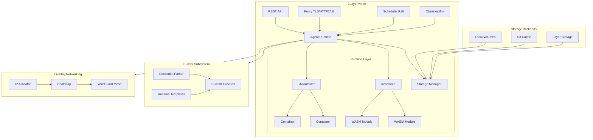

<p align="center">
  
</p>

<h1 align="center">ZLayer</h1>

<p align="center">
  A lightweight, Rust-based container orchestration platform with built-in networking, scaling, and observability.
</p>

<p align="center">
  <a href="https://zlayer.dev">Website</a> •
  <a href="https://zlayer.dev/docs">Documentation</a> •
  <a href="https://crates.io/crates/zlayer-spec">Crates.io</a>
</p>

## Overview

ZLayer provides declarative container orchestration without Kubernetes complexity. It uses [libcontainer](https://github.com/youki-dev/youki) (from the youki project) for direct container management - no daemon required.

### Key Features

- **Daemonless Runtime** - Uses libcontainer directly, no containerd/Docker daemon needed
- **WebAssembly Support** - First-class WASM runtime with WASIp1 & WASIp2 support via wasmtime
- **Multi-Language WASM SDKs** - Build WASM workloads from Rust, Go, Python, TypeScript, C, Zig, and more
- **Built-in Image Builder** - Dockerfile parser with buildah integration and runtime templates
- **Encrypted Overlay Networks** - WireGuard-based mesh networking with IP allocation and health checking
- **Smart Scheduler** - Node placement with Shared/Dedicated/Exclusive allocation modes
- **Built-in Proxy** - TLS termination, HTTP/2, load balancing on every node
- **Adaptive Autoscaling** - Scale based on CPU, memory, or requests per second
- **Init Actions** - Pre-start lifecycle hooks (wait for TCP, HTTP, S3 pull/push, run commands)
- **Health Checks** - TCP, HTTP, and command-based health monitoring
- **OCI Compatible** - Pull images from any OCI-compliant registry
- **REST API** - Deploy, manage, and build images via HTTP API with streaming progress
- **S3 Layer Persistence** - Persist container state to S3 with crash-tolerant uploads
- **OpenTelemetry Tracing** - Distributed tracing with OTLP export and context propagation

## Architecture



## Project Structure

```
crates/
├── agent/          # Container runtime (libcontainer integration, storage manager)
├── api/            # REST API server with build endpoints and streaming
├── builder/        # Dockerfile parser, buildah integration, runtime templates
├── init_actions/   # Pre-start lifecycle actions (TCP, HTTP, S3, commands)
├── layer-storage/  # S3-backed layer persistence with crash-tolerant uploads
├── observability/  # Metrics, logging, OpenTelemetry tracing
├── overlay/        # WireGuard overlay networking, IP allocation, health checks
├── proxy/          # L4/L7 proxy with TLS
├── registry/       # OCI image pulling and caching (with optional S3 backend)
├── scheduler/      # Raft-based distributed scheduler with placement logic
├── spec/           # Deployment specification types
└── zlayer-core/    # Shared types and configuration

bin/
└── runtime/        # Main zlayer binary
```

## Requirements

- Linux (kernel 5.4+)
- Rust 1.85+
- libseccomp-dev

```bash
# Ubuntu/Debian
sudo apt-get install libseccomp-dev

# Fedora/RHEL
sudo dnf install libseccomp-devel

# Arch
sudo pacman -S libseccomp
```

## Installation

### Quick Install (Recommended)

```bash
curl -fsSL https://zlayer.dev/install.sh | bash
```

### From GitHub Releases

Download the latest release for your architecture:

```bash
# For amd64 (latest)
curl -fsSL https://github.com/BlackLeafDigital/ZLayer/releases/latest/download/zlayer-linux-amd64.tar.gz | tar xz
sudo mv zlayer /usr/local/bin/

# For arm64 (latest)
curl -fsSL https://github.com/BlackLeafDigital/ZLayer/releases/latest/download/zlayer-linux-arm64.tar.gz | tar xz
sudo mv zlayer /usr/local/bin/
```

Or pin to a specific version:

```bash
# Replace VERSION with desired version (e.g., v0.1.0)
curl -fsSL https://github.com/BlackLeafDigital/ZLayer/releases/download/VERSION/zlayer-linux-amd64.tar.gz | tar xz
```

### From Source

```bash
# Clone the repo
git clone https://github.com/BlackLeafDigital/ZLayer.git
cd ZLayer

# Install dependencies (Ubuntu/Debian)
sudo apt-get install -y protobuf-compiler libseccomp-dev libssl-dev pkg-config cmake

# Build release binary
cargo build --release --package runtime

# Install
sudo cp target/release/zlayer /usr/local/bin/
```

## Quick Start

### 1. Define a deployment

```yaml
# deployment.yaml
version: v1
deployment: my-app

services:
  web:
    rtype: service
    image:
      name: nginx:latest
    endpoints:
      - name: http
        protocol: http
        port: 80
        expose: public
    scale:
      mode: adaptive
      min: 1
      max: 5
    health:
      check:
        type: http
        url: /health
        expect_status: 200
```

### 2. Deploy a WASM workload

ZLayer auto-detects WASM artifacts from OCI registries:

```yaml
# wasm-deployment.yaml
version: v1
deployment: my-wasm-app

services:
  handler:
    rtype: service
    image:
      # ZLayer auto-detects WASM artifacts by media type
      name: ghcr.io/myorg/my-wasm-handler:v1
    env:
      - name: LOG_LEVEL
        value: info
```

### 3. Deploy

```bash
zlayer deploy deployment.yaml
```

### 4. Check status

```bash
zlayer status my-app
```

## Deployment Spec

See [V1_SPEC.md](./V1_SPEC.md) for the complete specification.

### Resource Types

| Type | Description |
|------|-------------|
| `service` | Long-running, load-balanced container |
| `job` | Run-to-completion, triggered by endpoint/CLI |
| `cron` | Scheduled run-to-completion |

### Scaling Modes

| Mode | Description |
|------|-------------|
| `adaptive` | Auto-scale based on CPU/memory/RPS targets |
| `fixed` | Fixed number of replicas |
| `manual` | No automatic scaling |

### Node Allocation Modes

| Mode | Description |
|------|-------------|
| `shared` | Containers bin-packed onto nodes with available capacity |
| `dedicated` | Each replica gets its own node (1:1 mapping) |
| `exclusive` | Service has nodes exclusively to itself (no other services) |

### Storage & Persistence

ZLayer provides comprehensive storage options for containers.

#### Volume Mounts

Mount external storage into containers:

| Type | Description | Lifecycle |
|------|-------------|-----------|
| `bind` | Host path mounted into container | Host-managed |
| `named` | Persistent named volume | Survives container restarts |
| `anonymous` | Auto-named volume | Cleaned on container removal |
| `tmpfs` | Memory-backed filesystem | Lost on container stop |
| `s3` | S3-backed FUSE mount (requires s3fs) | Remote-managed |

#### Storage Tiers

Named and anonymous volumes support configurable performance tiers:

| Tier | Description | SQLite Safe |
|------|-------------|-------------|
| `local` | Direct local filesystem (SSD/NVMe) | Yes |
| `cached` | bcache-backed tiered storage | Yes |
| `network` | NFS/network storage | No |

#### Layer Persistence

Persist container filesystem changes (OverlayFS upper layer) to S3:

- **Automatic snapshots** - Tar + zstd compress the upper layer on container stop
- **Crash-tolerant uploads** - Multipart S3 uploads with resume capability
- **Content-addressable** - Layers keyed by SHA256 digest (automatic deduplication)
- **Cross-node restore** - Containers can resume state on different nodes

#### S3 Init Actions

Transfer files to/from S3 as part of container lifecycle:

| Action | Description |
|--------|-------------|
| `init.s3_pull` | Download files from S3 before container starts |
| `init.s3_push` | Upload files to S3 after container stops |

#### Example Storage Configuration

```yaml
services:
  api:
    image:
      name: myapi:latest
    storage:
      # Bind mount (read-only config)
      - type: bind
        source: /etc/myapp/config
        target: /app/config
        readonly: true

      # Named persistent volume
      - type: named
        name: api-data
        target: /app/data
        tier: local  # SQLite-safe

      # Anonymous cache (auto-cleaned)
      - type: anonymous
        target: /app/cache

      # Memory-backed temp
      - type: tmpfs
        target: /app/tmp
        size: 256Mi
        mode: 1777

      # S3 model storage (requires s3fs)
      - type: s3
        bucket: my-models
        prefix: v1/
        target: /app/models
        readonly: true
        endpoint: https://s3.us-west-2.amazonaws.com

    # S3 init actions for artifact transfer
    init:
      - action: init.s3_pull
        bucket: my-artifacts
        key: models/latest.bin
        destination: /app/models/model.bin
```

## Image Building

ZLayer includes a built-in image builder that supports Dockerfiles and runtime templates.

### Runtime Templates

Build images without writing a Dockerfile using pre-configured templates:

| Runtime | Description |
|---------|-------------|
| `node20`, `node22` | Node.js apps on Alpine |
| `python312`, `python313` | Python apps on Debian slim |
| `rust` | Static musl binaries |
| `go` | Static Go binaries |
| `deno` | Deno JavaScript/TypeScript runtime |
| `bun` | Bun JavaScript runtime |

### Building via API

```bash
# Build from a Dockerfile
curl -X POST http://localhost:3000/api/v1/build/json \
  -H "Content-Type: application/json" \
  -d '{
    "context_path": "/path/to/app",
    "tags": ["myapp:latest"]
  }'

# Build using a runtime template
curl -X POST http://localhost:3000/api/v1/build/json \
  -H "Content-Type: application/json" \
  -d '{
    "context_path": "/path/to/node/app",
    "runtime": "node22",
    "tags": ["myapp:latest"]
  }'

# Stream build progress via SSE
curl http://localhost:3000/api/v1/build/{id}/stream
```

### Building via CLI

```bash
# Build from Dockerfile
zlayer build /path/to/app -t myapp:latest

# Build with runtime template (auto-detected)
zlayer build /path/to/app -t myapp:latest --runtime node22

# List available templates
zlayer runtimes
```

## CLI Reference

The `zlayer` binary provides comprehensive command-line management:

### Node Management

```bash
# Initialize a new cluster (this node becomes leader)
zlayer node init --advertise-addr 10.0.0.1

# Join an existing cluster
zlayer node join 10.0.0.1:8080 --token <TOKEN> --advertise-addr 10.0.0.2

# List nodes in cluster
zlayer node list

# Show node status
zlayer node status

# Add labels to nodes (for node selectors)
zlayer node label <node-id> gpu=true

# Generate a join token for workers
zlayer node generate-join-token -d my-deploy -a http://10.0.0.1:8080
```

### Deployment Management

```bash
# Deploy from spec file
zlayer deploy deployment.yaml

# Validate a deployment spec
zlayer validate deployment.yaml

# View deployment status
zlayer status

# Stream logs from a service
zlayer logs -d my-app -s web --follow

# Stop a deployment
zlayer stop my-app --service web
```

### Build Commands

```bash
# Build from Dockerfile
zlayer build . -t myapp:latest

# Build with runtime template
zlayer build . --runtime node22 -t myapp:latest

# Auto-detect runtime from project files
zlayer build . --runtime-auto -t myapp:latest

# Build with arguments
zlayer build . --build-arg VERSION=1.0 -t myapp:1.0.0

# Multi-stage builds with target
zlayer build . --target production -t myapp:prod

# List available runtime templates
zlayer runtimes
```

### API Server

```bash
# Start the REST API server
zlayer serve --bind 0.0.0.0:8080

# With JWT secret
zlayer serve --bind 0.0.0.0:8080 --jwt-secret <secret>
```

### Token Management

```bash
# Create a JWT token for API access
zlayer token create --subject dev --hours 24 --roles admin

# Create token (quiet mode for scripting)
zlayer token create --quiet

# Decode and inspect a token
zlayer token decode <token>

# Show token system info
zlayer token info
```

### Spec Inspection

```bash
# Dump parsed spec as JSON
zlayer spec dump deployment.yaml --format json

# Dump parsed spec as YAML (default)
zlayer spec dump deployment.yaml

# Validate a spec file
zlayer spec validate deployment.yaml

# Inspect a running deployment
zlayer spec inspect my-deployment --format table
zlayer spec inspect my-deployment --api http://localhost:8080 --format json
```

### Local Development

```bash
# Run a deployment locally (development mode)
zlayer run deployment.yaml

# Dry run - validate and show plan
zlayer run deployment.yaml --dry-run

# With port offset for multiple instances
zlayer run deployment.yaml --port-offset 1000

# Production environment
zlayer run deployment.yaml --env prod
```

### WASM Commands

```bash
# Build WASM from source (auto-detects language)
zlayer wasm build .
zlayer wasm build --language rust --target wasip2 --optimize ./my-rust-app

# Export WASM as OCI artifact
zlayer wasm export ./app.wasm --name myapp:v1
zlayer wasm export ./app.wasm --name ghcr.io/myorg/myapp:latest --output ./oci-dir

# Push WASM to registry
zlayer wasm push ./app.wasm ghcr.io/myorg/myapp:v1
zlayer wasm push ./app.wasm --username $USER --password $TOKEN registry.example.com/app:v1

# Validate a WASM binary
zlayer wasm validate ./handler.wasm

# Inspect WASM binary info
zlayer wasm info ./handler.wasm

# Run a WASM image (auto-detected from registry)
zlayer run ghcr.io/myorg/my-wasm-handler:v1
```

## WebAssembly Support

ZLayer supports WebAssembly (WASM) as a first-class runtime alongside traditional OCI containers. WASM workloads benefit from near-instant cold starts, smaller image sizes, and universal portability.

### Supported Languages

| Tier | Languages | Notes |
|------|-----------|-------|
| **Tier 1** | Rust, Go, C/C++, Zig, AssemblyScript | Direct compilation to WASM |
| **Tier 2** | C#/.NET, Kotlin, Swift | Experimental/growing support |
| **Tier 3** | Python, JavaScript, Ruby, PHP, Lua | Interpreter-based (via WASM-compiled runtimes) |

### WASM vs Container Comparison

| Aspect | Container | WASM |
|--------|-----------|------|
| **Cold Start** | ~300ms | ~1-5ms |
| **Image Size** | 10MB - 1GB+ | 100KB - 10MB |
| **Isolation** | Linux namespaces/cgroups | WASM sandbox |
| **Portability** | Arch-specific (x86/ARM) | Universal bytecode |
| **exec() support** | Yes | No (single process model) |

### Building WASM Plugins

**Using ZLayer CLI (Recommended):**

```bash
# Build and push in one workflow (auto-detects language)
zlayer wasm build .
zlayer wasm push ./target/wasm32-wasip2/release/handler.wasm ghcr.io/myorg/handler:v1

# Or specify language and target explicitly
zlayer wasm build --language rust --target wasip2 --optimize .
zlayer wasm push ./handler.wasm ghcr.io/myorg/handler:v1
```

**Manual Build Commands:**

```bash
# Rust
cargo build --target wasm32-wasip2 --release
zlayer wasm push target/wasm32-wasip2/release/handler.wasm ghcr.io/myorg/handler:v1

# Go (TinyGo)
tinygo build -target=wasip2 -o handler.wasm .
zlayer wasm push handler.wasm ghcr.io/myorg/handler:v1

# C/C++ (WASI SDK)
clang --target=wasm32-wasip2 -o handler.wasm handler.c
zlayer wasm push handler.wasm ghcr.io/myorg/handler:v1

# Zig
zig build -Dtarget=wasm32-wasi
zlayer wasm push zig-out/bin/handler.wasm ghcr.io/myorg/handler:v1

# AssemblyScript
asc handler.ts -o handler.wasm
zlayer wasm push handler.wasm ghcr.io/myorg/handler:v1

# TypeScript (via jco)
jco componentize handler.js -o handler.wasm
zlayer wasm push handler.wasm ghcr.io/myorg/handler:v1
```

### WASM Detection

ZLayer auto-detects WASM artifacts using multiple signals:

1. **OCI 1.1+ `artifactType`** - Most authoritative
2. **Config `mediaType`** - `application/vnd.wasm.config.v0+json`
3. **Layer `mediaType`** - `application/wasm` fallback

No configuration required - just reference the image and ZLayer handles the rest.

### Building with WASM Support

```bash
# Build ZLayer with WASM runtime enabled
cargo build --release --features wasm

# Build with both Docker and WASM support
cargo build --release --features "docker,wasm"
```

For detailed WASM implementation documentation, see [WASM_DONE.md](./WASM_DONE.md).

## Runtime Modes

ZLayer supports multiple container runtime backends:

### Youki Runtime (Default on Linux)
Direct container management via libcontainer - no daemon required. Optimal performance with minimal overhead.

### Docker Runtime (Cross-Platform)
Uses the Docker daemon via bollard for cross-platform support (macOS, Windows, Linux). Enable with the `docker` feature:

```bash
# Build with Docker runtime support
cargo build --release --features docker

# Or build with all runtimes
cargo build --release --features "docker,wasm"
```

**Runtime Selection**:
- Linux: Prefers youki, falls back to Docker if unavailable
- macOS/Windows: Uses Docker automatically

### WASM Runtime
WebAssembly workloads via wasmtime. See [WebAssembly Support](#webassembly-support).

| Runtime | Platform | Daemon Required | Use Case |
|---------|----------|-----------------|----------|
| Youki | Linux only | No | Production (optimal) |
| Docker | All | Yes | Development, cross-platform |
| WASM | All | No | Lightweight, portable workloads |

## GitHub Action

ZLayer is available as a GitHub Action for CI/CD workflows:

```yaml
- uses: BlackLeafDigital/ZLayer@v1
  with:
    command: wasm build .
```

### Quick Examples

```yaml
# Build WASM plugin
- uses: BlackLeafDigital/ZLayer@v1
  with:
    command: wasm build --language rust --target wasip2

# Push to registry
- uses: BlackLeafDigital/ZLayer@v1
  with:
    command: wasm push ./handler.wasm ghcr.io/myorg/handler:latest

# Validate deployment spec
- uses: BlackLeafDigital/ZLayer@v1
  with:
    command: validate deployment.yaml
```

See [ACTION.md](./ACTION.md) for full documentation and examples.

## Observability

ZLayer includes built-in observability with Prometheus metrics and OpenTelemetry tracing.

### OpenTelemetry Tracing

Distributed tracing with automatic instrumentation of container operations:

- **OTLP Export** - Send traces to any OpenTelemetry-compatible backend (Jaeger, Tempo, etc.)
- **Context Propagation** - W3C Trace Context for distributed trace correlation
- **Container Spans** - Automatic spans for create, start, stop, remove, exec operations
- **Semantic Attributes** - Standard attributes (`container.id`, `service.name`, etc.)

#### Configuration via Environment Variables

```bash
# Enable tracing
export OTEL_TRACES_ENABLED=true
export OTEL_SERVICE_NAME=zlayer-agent
export OTEL_EXPORTER_OTLP_ENDPOINT=http://localhost:4317

# Sampling (0.0 to 1.0)
export OTEL_TRACES_SAMPLER_ARG=0.1  # Sample 10% of traces

# Environment tag
export DEPLOYMENT_ENVIRONMENT=production
```

### Prometheus Metrics

Expose metrics for scraping:

```bash
zlayer serve --metrics-bind 0.0.0.0:9090
```

Available metrics include container counts, request latencies, and resource utilization.

## Development

```bash
# Format code
cargo fmt

# Run clippy
cargo clippy --workspace -- -D warnings

# Run all tests
cargo test --workspace

# Run specific crate tests
cargo test -p agent
cargo test -p registry
cargo test -p builder
cargo test -p scheduler

# Build with specific features
cargo build --package runtime --features full
```

## License

Apache-2.0
