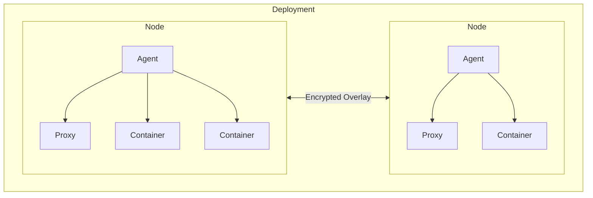
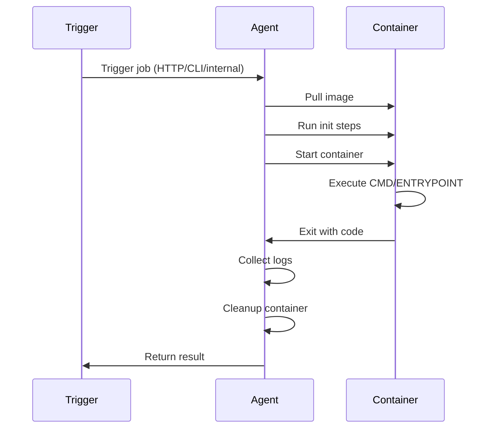

# ZLayer Service Specification (v1)

A typed, declarative service definition language for OCI-compatible containers.

This spec provides **lifecycle orchestration, networking, scaling, and placement** for containers, without Kubernetes complexity and without embedding application logic into YAML.

---

## 1. Goals

1. Single-file declarative configuration
2. OCI-native (libcontainer / Docker / containerd)
3. No cluster abstraction overhead
4. Built-in proxy on every node (TLS, HTTP/2, certs, tunneling)
5. Encrypted overlay networking by default
6. Adaptive autoscaling by default
7. Typed, statically-validatable schema
8. Init-style lifecycle actions (not long-running sidecars)
9. No templating / interpolation
10. Minimal primitives, composable behavior

---

## 2. Mental Model



- A **deployment** defines a set of workloads
- Every node runs:
  - Runtime agent
  - Built-in proxy (TLS, HTTP/2, certs, tunneling)
- Every deployment creates:
  - A **global encrypted overlay network**
- Every service creates:
  - A **service-scoped encrypted overlay**
- Nodes can:
  - Join globally
  - Or join a specific service via `key:service`
- **Containers run normally**
  - The container's actual process comes from the image's CMD/ENTRYPOINT
  - This spec controls *when* and *where* the container starts, plus routing/scaling/networking

---

## 3. Top-Level Structure

```yaml
version: v1
deployment: string

services:
  <name>:
    rtype: service | job | cron
    image: {}
    command: {}
    resources: {}
    env: {}
    network: {}
    endpoints: []
    scale: {}
    depends: []
    health: {}
    init: {}
    errors: {}
```

---

## 4. Resource Types (`rtype`)

### `service` (default)
- Long-running container
- Receives traffic
- Load-balanced
- Scalable
- Process lifetime = container lifetime

### `job`
- Run-to-completion container
- Triggered by endpoint, CLI, or internal system
- Automatically cleaned up after execution
- Process exits when done

### `cron`
- Scheduled run-to-completion container
- Same semantics as `job`, time-triggered
- Uses 7-field cron syntax: `sec min hour day-of-month month day-of-week year`

---

## 5. Image

```yaml
image:
  name: string
  pull_policy: always | if_not_present | never
```

---

## 6. Command Override (Optional)

By default, containers use the image's `ENTRYPOINT` and `CMD`. The `command` field allows optional overrides:

```yaml
command:
  entrypoint: [string]?  # Override image ENTRYPOINT
  args: [string]?        # Override image CMD
  workdir: string?       # Override working directory
```

### Behavior

| Field | Effect |
|-------|--------|
| `entrypoint` | Replaces the image's `ENTRYPOINT` |
| `args` | Replaces the image's `CMD` |
| `workdir` | Replaces the image's `WORKDIR` |

### Semantics

- If **neither** is specified, image defaults are used
- If **only `args`** is specified, image's `ENTRYPOINT` is preserved
- If **only `entrypoint`** is specified, image's `CMD` becomes arguments
- If **both** are specified, both are replaced

---

## 7. Resources (Limits)

Upper bounds, not reservations.

```yaml
resources:
  cpu: number      # CPU cores (e.g., 0.5, 2)
  memory: string   # Memory limit (e.g., "512Mi", "2Gi")
```

---

## 8. Environment Variables

```yaml
env:
  NODE_ENV: production
  DATABASE_URL: $E:DATABASE_URL
```

Values prefixed with `$E:` are resolved from the runtime environment at start time.
No interpolation, no templating.

---

## 9. Networking

### Overlay Networks

```yaml
network:
  overlays:
    service:
      enabled: true
      encrypted: true
      isolated: true
    global:
      enabled: true
      encrypted: true
```

- **Service overlay** - service replicas only
- **Global overlay** - all services in deployment
- No exposure unless defined in `endpoints`

### Join Policy

```yaml
network:
  join:
    mode: open | token | closed
    scope: service | global
```

- `open`: any trusted node in deployment can self-enroll
- `token`: requires a join key (recommended default)
- `closed`: only control-plane/scheduler can place replicas

---

## 10. Endpoints (Proxy Bindings)

Endpoints define **where traffic is bound**, not how requests are shaped.

```yaml
endpoints:
  - name: string
    protocol: http | https | tcp | udp | websocket
    port: number
    path: string?
    expose: public | internal
```

### Endpoint semantics by `rtype`

| `rtype` | Behavior |
|---------|----------|
| `service` | Traffic routed to running containers (load-balanced) |
| `job` | Connection triggers container execution, returns output |
| `cron` | Optional manual trigger; schedule is primary |

The proxy is built into every node and handles TLS, HTTP/2, certs, and tunneling.

---

## 11. Scaling

### Modes

```yaml
scale:
  mode: adaptive | fixed | manual
```

### Adaptive (Default)

```yaml
scale:
  mode: adaptive
  min: number
  max: number
  cooldown: duration?
  targets:
    cpu: percent?
    memory: percent?
    rps: number?
```

- Runtime scales up/down based on live metrics
- Load balancing automatically spans replicas
- Replicas can span multiple nodes

### Fixed

```yaml
scale:
  mode: fixed
  replicas: number
```

### Manual

```yaml
scale:
  mode: manual
```

---

## 12. Node Allocation

```yaml
node:
  mode: shared | dedicated | exclusive
  selector:
    labels:
      gpu: "true"
    prefer_labels:
      region: us-east
```

| Mode | Behavior |
|------|----------|
| `shared` | Bin-pack containers onto nodes with capacity |
| `dedicated` | Each replica gets its own node (1:1) |
| `exclusive` | Service owns nodes exclusively |

---

## 13. Dependencies (`depends`)

Defines **startup ordering and readiness gating**.

```yaml
depends:
  - service: string
    condition: started | healthy | ready
    timeout: duration
    on_timeout: fail | warn | continue
```

Semantics:
- `started`: dependent container process exists
- `healthy`: dependent service health check passes
- `ready`: dependent service is available for routing

---

## 14. Health Checks

Used for readiness, dependency resolution, and scaling signals.

```yaml
health:
  start_grace: duration?
  interval: duration?
  timeout: duration?
  retries: number
  check:
    type: tcp | http | command
    # For http:
    url: string?
    expect_status: number?
    # For tcp:
    port: number?
    # For command:
    command: string?
```

---

## 15. Init Actions

### Purpose

Init actions are:
- **Pre-start lifecycle steps**
- Executed **before the container process starts**
- Used for:
  - Waiting on dependencies
  - Validating environment
  - Performing one-off setup
  - Avoiding duplicated shell glue scripts

They **do not keep the container alive** and **do not replace the image CMD/ENTRYPOINT**.

### Definition

```yaml
init:
  steps:
    - id: string
      uses: string
      with: object?
      retry: number?
      timeout: duration?
      on_failure: fail | warn | continue
```

### Execution Model

1. Image is pulled
2. Init steps run in order
3. If required steps succeed:
   - Container process starts normally (image CMD/ENTRYPOINT)
4. On failure:
   - Behavior determined by `on_failure` and global error policy

### Built-in Init Actions

```yaml
# Wait for TCP port
- uses: init.wait_tcp
  with:
    host: string
    port: number

# Wait for HTTP endpoint
- uses: init.wait_http
  with:
    url: string
    expect_status: number?

# Run a command
- uses: init.run
  with:
    command: string
```

---

## 16. Error Handling

```yaml
errors:
  on_init_failure:
    action: fail | restart | backoff
  on_panic:
    action: restart | shutdown | isolate
```

| Action | Behavior |
|--------|----------|
| `restart` | Restart the container |
| `shutdown` | Stop the service |
| `isolate` | Remove from LB but keep for debugging |
| `backoff` | Exponential backoff before retry |

---

## 17. Complete Example

```yaml
version: v1
deployment: my-app

services:
  api:
    rtype: service
    image:
      name: ghcr.io/org/api:latest
      pull_policy: if_not_present

    command:
      args: ["--port=3000", "--env=production"]

    env:
      DATABASE_URL: $E:DATABASE_URL
      REDIS_URL: $E:REDIS_URL

    init:
      steps:
        - id: wait-db
          uses: init.wait_tcp
          with:
            host: db.global
            port: 5432
          timeout: 60s
          on_failure: fail

        - id: run-migrations
          uses: init.run
          with:
            command: /app/migrate --apply
          timeout: 300s
          on_failure: fail

    endpoints:
      - name: api
        protocol: https
        port: 3000
        path: /api
        expose: public

    health:
      interval: 10s
      timeout: 5s
      retries: 3
      check:
        type: http
        url: /health
        expect_status: 200

    scale:
      mode: adaptive
      min: 2
      max: 50
      cooldown: 15s
      targets:
        cpu: 70%
        rps: 800

    depends:
      - service: db
        condition: healthy
        timeout: 120s
        on_timeout: fail

  db:
    rtype: service
    image:
      name: postgres:16-alpine

    resources:
      cpu: 2
      memory: 4Gi

    endpoints:
      - name: postgres
        protocol: tcp
        port: 5432
        expose: internal

    scale:
      mode: fixed
      replicas: 1

    node:
      mode: dedicated

  cleanup-job:
    rtype: cron
    schedule: "0 0 3 * * * *"  # Daily at 3 AM
    image:
      name: ghcr.io/org/cleanup:latest

    command:
      args: ["--older-than=30d"]

    resources:
      cpu: 0.5
      memory: 512Mi
```

---

## 18. Multi-Node Join

### Join Token Format

```
<key>:<service>
```

Examples:
- `abc123:api`
- `abc123:worker`

### Join Semantics

When a node runs:

```bash
zlayer join abc123:api
```

The node will:
1. Authenticate key
2. Resolve service from deployment manifest
3. Join required overlays
4. Pull image
5. Run init steps
6. Start container
7. Register with service discovery + load balancer
8. Begin serving traffic once ready

---

## 19. Job Semantics

For `rtype: job`:



- Container is automatically removed after execution
- Logs are retained per retention policy (default: 1 hour)
- Exit code tracked (0 = success)

---

## 20. Cron Semantics

For `rtype: cron`:

```yaml
schedule: "0 0 12 * * MON-FRI *"  # Weekdays at noon
```

- Scheduler triggers container execution periodically
- Same lifecycle as `job`
- 7-field cron: `sec min hour day month weekday year`

---

## License

Apache-2.0
